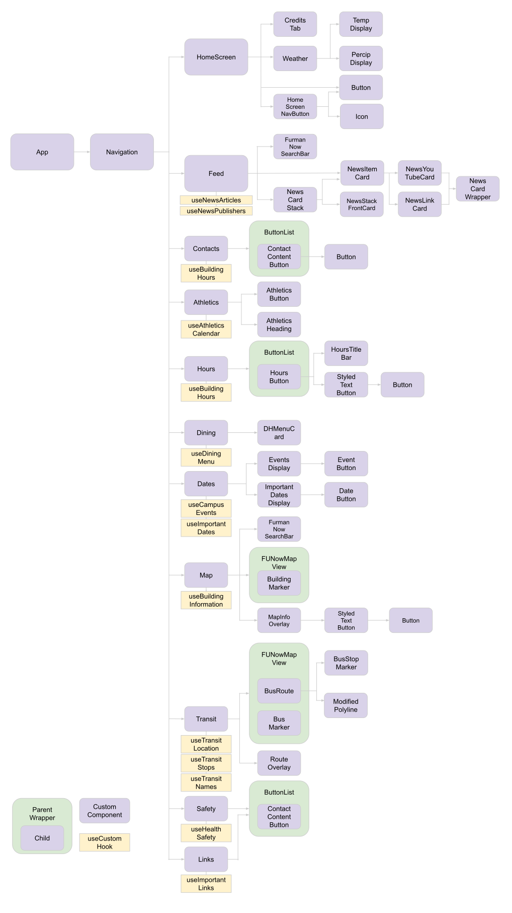

## Table of contents
{: .no_toc .text-delta }

1. TOC
{:toc}
---
# Root Directory & Program Structure
The codebase is organized primarily through the `App.jsx` file, whose `App` component is the root of the app. A basic tree of all custom component and hook references would look like the following:

## App.jsx
The actual Furman Now! app is run out of the `App.jsx` file in the project's root directory. `App.jsx` is used for all pre-launch loading, such as the use of `expo-font` to load in fonts and `expo-splash-screen` to hide the screen until loading is complete. This also where the color scheme is set, using the `useColorScheme` hook to determine if a device is in light or dark mode and setting the scheme based on that.

## colors.js
This file contains the color scheme for the app, and sets up the dark and light themes. Colors can be adjusted here to change the entire setup of the app. The app uses 12 main colors between the two color schemes, and 5 fonts

These colors are then assigned to several different style attributes which are assigned for each scheme and then used in various places. `background` is typically the background color of a page; `card` is used for things like buttons or list containers; `text` is used for text that goes on the standard `background`. `notification` is typically used for the background of a title or a pressed button, `notificationText` is used for text on a button being pressed, and `notificationContrast` is used for text on a heading so that it is readable. `primary` is primarily used for the header at the top of the app.

`styling`s can be applied to add a particular type of style to a component; the only one currently in use is the `shadows` style, for adding a shadow around buttons. 

## Configuration Files
Several files in the root directory are used for configuring various aspects within the project. `packages.json` outlines the various dependencies in the project, `eas.json` allows configuration for the EAS build/submit/update process, and `app.json` allows various platform-dependent specifiations, as well as assignment of things like the app icon and splash screen image.

## navigation.jsx
`App.jsx` calls the `Navigation` component of `navigation.jsx`, which sets up all the main pages of the app and the stack navigator, then initalizes the home page with the buttons to travel between the pages. The `pages` list allows specification of the pages which can be reached by the main button panel on the home page of the app, as well as which screens are loaded when each button is called. Icons are also assigned to each page here, as are unique names which can be used by the navigation methos to travel to them. The `screenOptions` attribute of the `<Stack.Group>` component additionally specifies how the header looks.

The `pages` list is both used to initialize every screen, and to let the Home Screen know which pages it can navigate to. Since components cannot be passed as props, the component must be removed from the list before it can be passed in, hence the mapping when assinging the `initialParams` to the `Home` screen's `<Stack.Screen>`. The `options={{title: ___}}` assignments specific what name will be at the top of the screen while the screen is displaying, and what the back arrow will say when it gives the option to return.

## API Keys
There are several API keys which are needed for the app to build. A Google Maps API key is kept in `app.json` for Android devices to be able to access the map. This key was generated from the Google Cloud Console using the furmannowapp email.A code for the App Store Connect API is similarly stored in `eas.json` for submissions, and one for the playstore is linked in `eas.json` but stored in a seperate `.json` file with a long name. 